<!-- ═══════════════════════════════════════════════════════════
     SHADOW MONARCH PROFILE README v3  |  VECTOR NOMAD HP88
     Theme: Solo Leveling inspired System UI
     All visuals in /assets are original animated SVGs (no copyrighted art)
     Upload the WHOLE assets/ folder next to this README.md
     ═══════════════════════════════════════════════════════════ -->

<div align="center">



<br/>

*“I alone level up.”* 🗡️

<!-- OPTIONAL: apni pasandida Jin-Woo GIF yahan lagao
     1. GIF ko repo ke assets/ folder me upload karo (e.g. assets/jinwoo.gif)
     2. Niche wali line uncomment karo
 -->

<br/>

<a href="#"></a>
<a href="#"></a>
<a href="#"></a>

<br/><br/>

[](https://github.com/VECTORNOMADHP88)
[](https://github.com/VECTORNOMADHP88)
[](https://github.com/VECTORNOMADHP88?tab=repositories)

<br/>

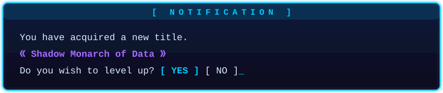

<br/><br/>

**⚡ QUICK WARP ⚡**

[🪟 Status](#status) • [🌀 Gates](#gates) • [📜 Quests](#quests) • [🗡️ Daggers](#daggers) • [👤 Army](#army) • [🎖️ Skills](#skills) • [📊 Stats](#stats) • [🏆 Titles](#titles) • [📖 Rules](#rules) • [🍀 Luck](#luck) • [👾 Logs](#logs)

</div>

<div align="center"></div>

<a name="status"></a>
<div align="center"></div>

<div align="center">

| 🪪 Hunter License | 🕸️ Stat Radar |
| :---: | :---: |
|  | 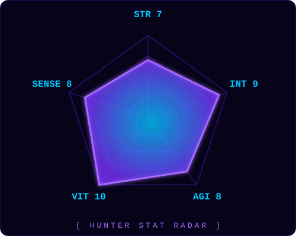 |

</div>

<div align="center">

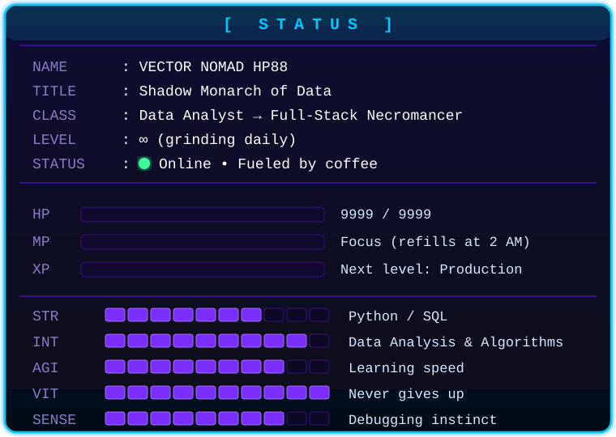

</div>

> 💬 **Main ek digital nomad hu**, jo vectors, data aur algorithms ke beech traverse karta hai. Philosophy simple hai: *clean code likho, aesthetic interfaces banao, aur data ko apni kahani khud sunane do.*

<div align="center">
</div>

<div align="center"></div>

<a name="gates"></a>
<div align="center"></div>

<div align="center">


### 🔴 **BhuNetra** &nbsp;•&nbsp; `🚧 Dungeon in progress`

*An open-source, real-data-only hazard platform for India.*


</div>

- 🌡️ **Hazards covered:** heat • air quality • rain/flood • fires • earthquakes *(exposure only)*
- 🔮 **Forecasts:** 24–72 hours ahead, with **SHAP explanations** so predictions are never a black box
- 🌐 **For everyone:** beginners, citizens/officials and researchers • **Hindi / English** UI
- 🔑 **Core runs with zero API keys**, built only on real public data (Open-Meteo, OpenAQ, NASA FIRMS, USGS)

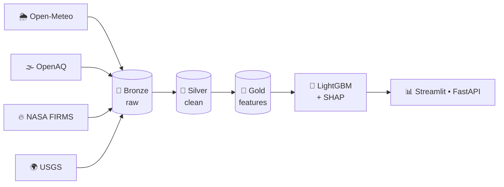

<details>
<summary><b>🗺️ BhuNetra Quest Log: 9 Phases (tick karte jao)</b></summary>

<br/>

- [ ] **Phase 1** — Plan, scaffold, verified data sources
- [ ] **Phase 2** — *(update me)*
- [ ] **Phase 3** — *(update me)*
- [ ] **Phase 4** — *(update me)*
- [ ] **Phase 5** — *(update me)*
- [ ] **Phase 6** — *(update me)*
- [ ] **Phase 7** — *(update me)*
- [ ] **Phase 8** — *(update me)*
- [ ] **Phase 9** — *(update me)*

> 💡 Jaise-jaise phase complete ho, `[ ]` ko `[x]` kar do. Recruiters ko progress dikhta hai.

</details>

<details>
<summary><b>🔒 Locked Gates (future dungeons)</b></summary>

<br/>

| Gate | Rank | Status |
| :--- | :---: | :---: |
| Vector-database semantic search project | `B` | 🔒 Locked |
| Generative-AI assistant for data exploration | `B` | 🔒 Locked |
| Advanced-algorithms visualiser | `C` | 🔒 Locked |

</details>

<!-- 👉 Apni BhuNetra repo ka sahi link yahan lagao -->
<div align="center">

[](https://github.com/VECTORNOMADHP88?tab=repositories)

</div>

<div align="center"></div>

<a name="quests"></a>
<div align="center"></div>

<div align="center">

| 🎯 Quest | 📖 Details | 🏆 Reward |
| :--- | :--- | :---: |
| **Mission** | Complex problems ko streamlined, aesthetic solutions mein badalna | `+100 XP` |
| **Current Dungeon** | Advanced Algorithms • Generative AI • Vector Databases | `+250 XP` |
| **Hidden Quest** | Open-source mein contribute karna aur data se sach nikalna | `+500 XP` |
| **Superpower** | Coffee + good vibes → scalable architecture | `Passive` |

</div>

### ✅ Today's Checklist
- [ ] 🧠 Ek naya concept seekhna (SQL / Python / ML)
- [ ] 💻 Kam se kam 1 commit karna
- [ ] 📝 Jo seekha usko apne shabdon mein likhna
- [ ] 🧹 Ek messy dataset ko saaf karna
- [ ] 💧 Paani peena aur thoda break lena

<div align="center"></div>

<a name="daggers"></a>
<div align="center"></div>

<div align="center">


| ⚔️ Weapon | 🔍 Real Tool | ✨ Effect |
| :---: | :---: | :--- |
| **Kasaka's Venom Fang** | `SQL` | Data ko seedha cheer ke answer nikalta hai |
| **Knight Killer** | `Python + Pandas` | Messy datasets ko ek hi vaar mein saaf karta hai |
| **Demon King's Dagger** | `DuckDB` | Blazing-fast analytics, zero setup |
| **Shadow Blade** | `Git` | Har change ka time-travel record |
| **Orb of Vision** | `Streamlit / Plotly` | Data ko live, interactive dashboards mein dikhata hai |

</div>

<div align="center"></div>

<a name="army"></a>
<div align="center"></div>

*Jab main bolta hu **"ARISE"**, ye saare soldiers uthte hain:*

<div align="center">

| 🌑 Shadow | 🏅 Rank | 🧩 Role in my stack |
| :---: | :---: | :--- |
| **Igris** 🗡️ | Knight Commander | **Python** — sabse wafadar, har mission mein aage |
| **Beru** 🐜 | Marshal | **PostgreSQL** — heavy data, bina thake |
| **Iron** 🛡️ | Elite Knight | **Docker** — sab kuch container mein surakshit |
| **Tank** 🐻 | Elite Knight | **Linux** — solid foundation, kabhi nahi hilta |
| **Tusk** 🔮 | Elite Mage | **Generative AI** — jaadu jo sabko hairaan kare |
| **Kaisel** 🐉 | Flying Mount | **Cloud / Deploy** — code ko duniya tak udaata hai |

### ✨ **ARISE** ✨
*Ek se shuru hua tha, ab poori army hai.*

</div>

<div align="center">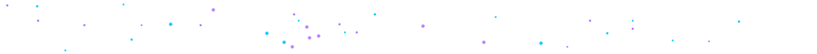</div>

<a name="skills"></a>
<div align="center"></div>

<div align="center">

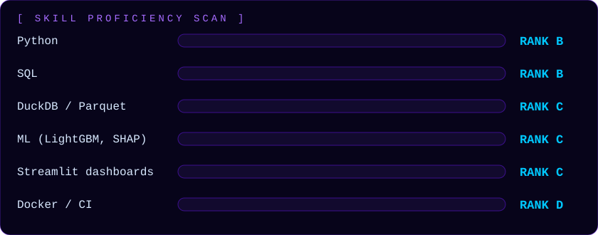

<br/>


<br/><br/>

*Ranks E → S. Ye meri apni honest rating hai, aur har hafte upar ja rahi hai.* 📈

</div>

<details>
<summary><b>📋 Rank table (text version)</b></summary>

<br/>

| Skill | Rank | Progress |
| :--- | :---: | :--- |
| 🐍 Python | `B` | ▰▰▰▰▰▰▰▱▱▱ |
| 🗄️ SQL | `B` | ▰▰▰▰▰▰▰▱▱▱ |
| 🦆 DuckDB / Parquet | `C` | ▰▰▰▰▰▱▱▱▱▱ |
| 🤖 ML (LightGBM, SHAP) | `C` | ▰▰▰▰▱▱▱▱▱▱ |
| 📊 Dashboards (Streamlit) | `C` | ▰▰▰▰▰▱▱▱▱▱ |
| 🐳 Docker / CI | `D` | ▰▰▰▱▱▱▱▱▱▱ |

</details>

<div align="center"></div>

<a name="stats"></a>
<div align="center"></div>

<div align="center">
  <a href="https://github.com/VECTORNOMADHP88">
    
  </a>
  <a href="https://github.com/VECTORNOMADHP88">
    
  </a>
</div>

<br/>

<div align="center">
  <a href="https://github.com/VECTORNOMADHP88">
    
  </a>
</div>

<br/>

<div align="center">
  <!-- Snake animation: iske liye .github/workflows/snake.yml add karo aur Action ek baar run karo -->
  <picture>
    <source media="(prefers-color-scheme: dark)" srcset="https://raw.githubusercontent.com/VECTORNOMADHP88/VECTORNOMADHP88/output/github-contribution-grid-snake-dark.svg">
    <source media="(prefers-color-scheme: light)" srcset="https://raw.githubusercontent.com/VECTORNOMADHP88/VECTORNOMADHP88/output/github-contribution-grid-snake.svg">
    
  </picture>
</div>

<div align="center"></div>

<a name="titles"></a>
<div align="center"></div>

<div align="center">

| Title | Condition | Status |
| :--- | :--- | :---: |
| 🌑 **Shadow Monarch of Data** | Data ko apna sipahi banana | 🔓 Unlocked |
| 🏗️ **Gate Builder** | Ek open-source dungeon (BhuNetra) shuru karna | 🔓 Unlocked |
| 📚 **Eternal Learner** | Roz kuch naya seekhna | 🔓 Active |
| ⭐ **First Star** | Kisi repo par pehla star milna | 🔒 Locked |
| 🤝 **Guild Member** | Kisi open-source project mein PR merge hona | 🔒 Locked |
| 🚀 **Gate Cleared** | BhuNetra ke saare 9 phases complete karna | 🔒 Locked |
| 👑 **S-Rank Hunter** | Production-grade platform live deploy karna | 🔒 Locked |

</div>

<details>
<summary><b>🎁 Hidden titles (click)</b></summary>

<br/>

- 🕵️ **Bug Slayer** — ek mushkil bug ko raat bhar mein khatam karna
- 🧹 **Data Janitor** — 100,000 messy rows ko bina rote saaf karna
- ☕ **Caffeine Mage** — coffee se compile hone wala code

</details>

<div align="center"></div>

<a name="rules"></a>
<div align="center"></div>

> **1.** 🧠 *Samajh ke seekho, ratta mat maaro.* Pehle kyun, phir kaise.
>
> **2.** 🧪 *Sirf real data.* Fake numbers se kabhi sach nahi niklta.
>
> **3.** 🪶 *Simple likho.* Jo kal khud na samajh aaye, wo clever code nahi, bug hai.
>
> **4.** 🛡️ *Honest raho.* Jo kaam nahi kiya, "kaam nahi kiya" bolo, fake success mat dikhao.
>
> **5.** 🔁 *Chhote steps, roz.* Ek-ek phase, ek-ek commit.
>
> **6.** 🌍 *Sab ke liye banao.* Beginner se researcher tak, Hindi aur English dono mein.
>
> **7.** 🤝 *Share karo.* Open source mein jo mila, wapas do.

<div align="center"></div>

<a name="luck"></a>
<div align="center"></div>

<details>
<summary><b>🔮 Click to reveal the Shrine of Good Luck</b></summary>

<br/>

*Duniya bhar ke good-luck charms se is profile par aane wale har insaan (aur mere code) ko success milti rahe.*

<div align="center">

| 🐱 Maneki-Neko 🇯🇵 | 🍀 Four-Leaf Clover 🇮🇪 | 🧿 Nazar / Evil Eye 🇹🇷 | 🕸️ Dreamcatcher 🇺🇸 |
| :---: | :---: | :---: | :---: |
| Wealth, prosperity aur successful PR merges | Extreme luck, zero syntax errors | Servers ko crash aur buri nazar se bachata hai | Bure ideas filter, sirf pure inspiration |

**Buff Active:** `Code compiles on first try` • `Clean datasets` • `Coffee stays hot` • `No bugs, only features`

</div>

</details>

<div align="center"></div>

<a name="logs"></a>
<div align="center"></div>

<details>
<summary><b>❓ FAQ (System answers)</b></summary>

<br/>

**Q: Aap kya karte ho?**
Data analytics seekh raha hu aur BhuNetra jaisa open-source hazard platform bana raha hu.

**Q: Collaborate kar sakte hain?**
Bilkul. Issue kholo ya message karo, naye gates mein saath chalte hain.

**Q: Ye profile design kaise bana?**
Saare animated visuals original SVG hain. Koi copyrighted art use nahi hua.

</details>

<div align="center">


<br/><br/>

```text
[SYSTEM] Quest complete: "Scroll the profile"
[SYSTEM] Reward: +1 respect, +1 coffee
[SYSTEM] Want to collaborate?  →  Open an Issue or say hi 👋
```


</div>
